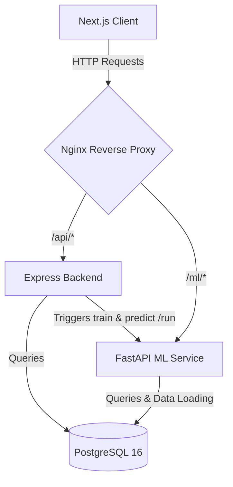
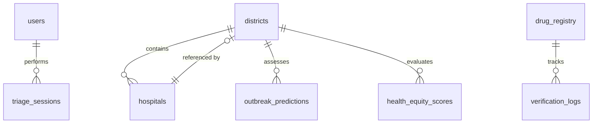

# MediSense BD — Comprehensive Codebase Analysis Report

MediSense BD is a unified health intelligence platform for Bangladesh. It integrates epidemic forecasting, healthcare navigation, automated Bengali symptom triage, and DGDA drug authenticity verification into a cohesive system.

---

## 1. System Architecture Overview

The system is constructed as a modern, multi-tier containerized application. The components communicate over an isolated bridge network, managed by Nginx as a reverse proxy.



### Key Services & Technologies
*   **Reverse Proxy (`nginx/`)**: Nginx reverse proxy routes requests dynamically:
    *   `/api/` is mapped to the Express backend.
    *   `/ml/` is mapped to the FastAPI machine learning inference service.
    *   All other routes fall back to the Next.js frontend.
*   **Frontend (`client/`)**: Built on **Next.js 16 (App Router)**, **React 19**, and **TypeScript**. It utilizes:
    *   **Tailwind CSS 4** for layout styling.
    *   **Framer Motion** for animations and smooth transitions.
    *   **Recharts** for time-series forecasting visualization.
    *   **React Leaflet** for geospatial map overlays (choropleths and routing).
*   **Express Backend (`server/`)**: A Node.js API acting as the central gatekeeper, managing:
    *   JWT-based user authentication and route protection.
    *   Database connection pool management (`pg`).
    *   Inter-service communication with the FastAPI ML model.
    *   CSV bulk data import/export utilities.
*   **ML Inference Service (`ai/`)**: A Python service powered by **FastAPI** and **Uvicorn**, housing:
    *   A **Random Forest Classifier** (`scikit-learn` and `joblib`) for predicting multi-disease outbreak probabilities.
    *   Fallback mock **BanglaBERT** and **LSTM** models for symptom triage and time-series forecasting.
    *   Data manipulation pipelines using `pandas` and `numpy`.
*   **Database (`db/`)**: **PostgreSQL 16 (Alpine)**, which stores system users, geographic districts of Bangladesh, health equity indices, hospitals, drug registries, and verification logs.

---

## 2. Database Schema & Data Models

The database contains 9 main tables. The design maintains relationships between geographic entities, health facilities, predictions, and audit logs.



### Table Definitions & Roles
1.  **`users`**: Contains authentication records (hashed passwords using `bcryptjs`) and roles (`admin`, `analyst`).
2.  **`districts`**: A master table containing all 64 districts of Bangladesh with geographic centers (latitudes/longitudes) and populations.
3.  **`hospitals`**: Healthcare facilities mapped to `districts` containing structural parameters (bed capacities, emergency availability, contact numbers).
4.  **`drug_registry`**: Synced with the Directorate General of Drug Administration (DGDA) to track brand names, generic formulations, manufacturers, barcodes, and authenticity status (`verified`, `counterfeit`, `suspicious`).
5.  **`outbreak_predictions`**: Holds historical data and next-day forecasts for diseases (e.g., Dengue, Diarrhea, Influenza, Typhoid) alongside climatic features (temperature, humidity, rainfall) and seasons.
6.  **`health_equity_scores`**: Mapped at the Upazila level to evaluate healthcare coverage ratios (doctors, beds, vaccines) to compute local equity indexes.
7.  **`triage_sessions`**: Logs patient symptom queries and the resulting AI triage severity determination.
8.  **`verification_logs`**: Logs barcode scanning outcomes, recording confidence scores and whether audited drugs were authentic.
9.  **`activity_feed`**: Unified audit log tracking warnings, system errors, and notifications.

---

## 3. Deep Dive into Core Functional Pillars & Code Logic

### A. Epidemic Forecasting (ML Pipeline)
Outbreak predictions are triggered from the client, routed through Express (`/api/predict/run`), which sends a POST request to FastAPI (`/ml/predict/train_and_predict`).
*   **Code Logic (`ai/outbreak_prediction.py`)**:
    *   **Data Preprocessing**: The dataset is loaded via `pandas`. Missing climatic values are imputed using dataset means (e.g., fallback to 30.0 for temperature). The categorical strings `season_type` and `disease` are encoded into integers using `sklearn.preprocessing.LabelEncoder`.
    *   **Model Training**: A `RandomForestClassifier` (configured with 100 estimators) is trained on the feature set `[district_id, temperature, humidity, rainfall_mm, season_encoded]`. The target variable is the `disease_encoded`. The trained model and label encoders are saved locally as pickle files (`.pkl`) via `joblib`.
    *   **Inference & Simulation**: For the next day's forecast, the model's `predict_proba()` method generates probabilities for all tracked diseases based on the latest weather data. The FastAPI endpoint then scales this probability into synthetic case counts using the formula: `predicted_cases = int(prob * 300 + random.randint(10, 50))`. These records are committed to the `outbreak_predictions` PostgreSQL table.
*   **CSV Import/Export**: Analysts can upload CSVs (`/api/predict/upload`). The Express route parses the CSV, validates column headers using dynamic index lookups to prevent case/spacing issues, maps district names to database IDs via an in-memory dictionary cache, and performs a bulk transaction insert.

### B. Healthcare Navigation & Geolocation Routing
When the client triggers an SOS event, the application detects the user's GPS coordinates (`navigator.geolocation`) and queries `/api/navigate/nearest?lat={lat}&lng={lng}`.
*   **Haversine Distance Logic (`server/routes/navigate.js`)**: Instead of relying on a dedicated geospatial extension, the backend calculates the nearest hospitals natively inside a PostgreSQL query to ensure high performance.
    *   **SQL Logic**: It utilizes the Haversine formula translated into an inline SQL expression to calculate the great-circle distance between the user's point `($1, $2)` and the hospital's point `(h.lat, h.lng)`:
        ```sql
        SELECT h.*, d.name as district_name,
               (6371 * acos(
                 cos(radians($1)) * cos(radians(h.lat)) *
                 cos(radians(h.lng) - radians($2)) +
                 sin(radians($1)) * sin(radians(h.lat))
               )) AS distance_km
        FROM hospitals h JOIN districts d ON h.district_id = d.id
        WHERE h.has_emergency = true
        ORDER BY distance_km ASC LIMIT 5;
        ```
    *   The query filters out facilities without emergency services, orders the results by the computed `distance_km`, and limits to the nearest 5.

### C. Bengali Triage Chatbot
Users write symptoms in Bengali on the frontend. While the UI mimics an advanced model ("BanglaBERT"), the current implementation uses a highly efficient dictionary-based keyword matcher.
*   **NLP Interaction & Logic (`server/routes/verify.js`)**:
    *   The Node.js server defines a `symptomMap` dictionary correlating Bengali keywords to risk levels. Examples include `'শ্বাসকষ্ট'` (breathing difficulty, critical), `'জ্বর'` (fever, moderate), and `'মাথাব্যথা'` (headache, low).
    *   The logic iterates over the dictionary. If a keyword is found as a substring in the user's input (`symptoms_text.includes(keyword)`), the symptom is recorded.
    *   A numerical priority is assigned (`low: 0, moderate: 1, critical: 2`). The overall triage response inherits the maximum severity detected among all matched keywords. The interaction is logged to `triage_sessions`.

### D. Drug Authentication
Evaluates drug barcodes or brand names against the DGDA registry database.
*   **Verification Logic (`server/routes/verify.js`)**:
    *   If a barcode is provided, the API executes an exact match query (`WHERE barcode = $1`). If a drug name is provided, a wildcard search is executed (`WHERE LOWER(brand_name) LIKE LOWER($1)`).
    *   If a match is found, the system evaluates the `status` column. A status of `'verified'` flags the drug as authentic. 
    *   To mimic real-world ML scanning uncertainty, the API generates a simulated confidence score (`0.95 + Math.random() * 0.05` for authentic drugs, lower for suspicious items). The outcome is recorded into `verification_logs` to power the dashboard analytics.

---

## 4. Frontend Theme & Design System

The platform features a premium dark glassmorphic layout anchored in a custom teal design system:

*   **Color Tokens**:
    *   Primary Backgrounds: Deep Teal (`#031c1c` to `#0d4f4f`).
    *   Typography: Inter for running body copy and Outfit for headers/subheaders.
    *   Accents: Amber (`#f59e0b`) for alerts/moderate risks, red (`#ef4444`) for critical items/SOS, green (`#22c55e`) for verified drugs.
*   **Glassmorphism styling**: Defined globally via CSS classes:
    ```css
    .glass-card {
      background: rgba(255, 255, 255, 0.06);
      backdrop-filter: blur(24px);
      border: 1px solid rgba(255, 255, 255, 0.12);
      box-shadow: 0 8px 32px rgba(0, 0, 0, 0.3), 0 0 40px rgba(20, 184, 166, 0.15);
    }
    ```
*   **Animations**: Handled smoothly using Framer Motion combined with pulsing and scanning line animations for barcode readers.

---

## 5. Docker Orchestration Details

The entire environment builds and runs using `docker-compose.yml` under a shared bridge network (`medisense-net`):

| Service Name | Base Image / Build Path | Port Exposure | Dependencies | Key Envs |
| :--- | :--- | :--- | :--- | :--- |
| **`nginx`** | `./nginx` | `80:80` | `frontend`, `backend`, `ml-inference` | - |
| **`database`** | `postgres:16-alpine` | Internal (5432) | - | `POSTGRES_DB=medisense` |
| **`backend`** | `./server` | Internal (3000) | `database` (healthy) | `DB_URL`, `JWT_SECRET` |
| **`ml-inference`**| `./ai` | Internal (8000) | `database` (healthy) | `DB_URL` |
| **`frontend`** | `./client` | Internal (3000) | `backend` | `NEXT_PUBLIC_API_URL` |

---

## 6. Development Observations & Recommendations

1.  **Introduce Connection Pool Isolation**: The python FastAPI training endpoint currently initiates independent connections using `psycopg2.connect` on each request. Incorporating a connection pool (e.g., `psycopg2.pool.SimpleConnectionPool`) or using SQLAlchemy would make it more robust.
2.  **ML Model Scalability**: The current Random Forest model fits training data on-the-fly and saves pickle files locally to disk. In production, this should write to a central model registry (e.g., MLflow) or use persistent volumes to avoid memory limits and race conditions when multiple model run actions trigger concurrently.
3.  **Geospatial Optimization**: The database does not currently use the `PostGIS` extension. While standard Haversine calculations in SQL are sufficient for the 5-nearest-hospitals query under current data volumes, migrating to a PostGIS geometry/geography data type with `GIST` indexes will be necessary if dataset size scales up significantly.
4.  **BenglaBERT Integration**: The triage route currently relies on keyword matching. Connecting a real Hugging Face inference pipeline or hosting a local ONNX runtime of BanglaBERT in the Python FastAPI layer would improve semantic symptom matching.
