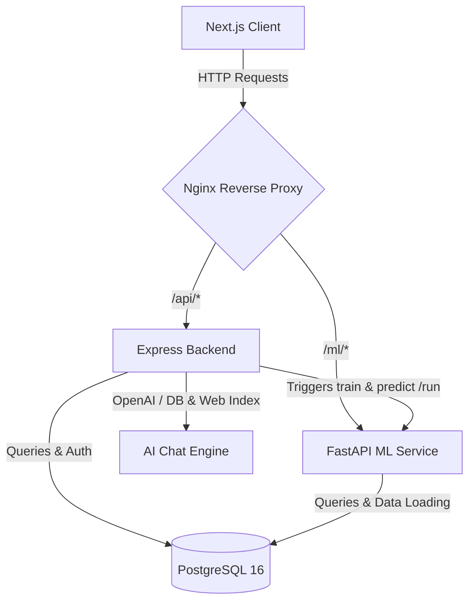
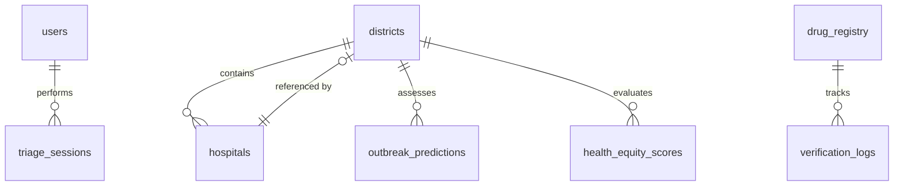

# MediSense BD — Comprehensive Codebase Analysis Report

MediSense BD is a unified health intelligence platform for Bangladesh. It integrates epidemic forecasting, healthcare navigation, automated Bengali symptom triage, DGDA drug authenticity verification, dedicated female healthcare & mental support, and an interactive page-wide AI Chatbot into a cohesive system.

---

## 1. System Architecture Overview

The system is constructed as a modern, multi-tier containerized application. The components communicate over an isolated bridge network, managed by Nginx as a reverse proxy.



### Key Services & Technologies
*   **Reverse Proxy (`nginx/`)**: Nginx reverse proxy routes requests dynamically:
    *   `/api/` is mapped to the Express backend.
    *   `/ml/` is mapped to the FastAPI machine learning inference service.
    *   All other routes fall back to the Next.js frontend.
*   **Frontend (`client/`)**: Built on **Next.js 16 (App Router)**, **React 19**, and **TypeScript**. It utilizes:
    *   **Tailwind CSS 4** for glassmorphic styling.
    *   **Framer Motion** for micro-animations and smooth drawer transitions.
    *   **Recharts** for time-series forecasting visualization.
    *   **React Leaflet** for geospatial map overlays (choropleths and routing).
    *   **FormattedMarkdown**: Custom styled markdown renderer converting headers (`###`), bold highlights, bullet/numbered lists, source badges, and full Markdown Tables (`<table>`) into responsive glassmorphic UI.
*   **Express Backend (`server/`)**: A Node.js API acting as the central gatekeeper, managing:
    *   JWT-based user authentication, registration (Sign Up), gender metadata, and role-based route protection.
    *   Database connection pool management (`pg`).
    *   AI Chat Router (`/api/chat/query` & `/api/chat/female-care`) interfacing with Groq Cloud AI (`llama-3.3-70b-versatile`), OpenAI API, or internal DB & web search index.
    *   Inter-service communication with the FastAPI ML model.
    *   CSV bulk data import/export utilities.

*   **ML Inference Service (`ai/`)**: A Python service powered by **FastAPI** and **Uvicorn**, housing:
    *   A **Random Forest Classifier** (`scikit-learn` and `joblib`) for predicting multi-disease outbreak probabilities.
    *   Fallback mock **BanglaBERT** and **LSTM** models for symptom triage and time-series forecasting.
    *   Data manipulation pipelines using `pandas` and `numpy`.
*   **Database (`db/`)**: **PostgreSQL 16 (Alpine)**, which stores system users, geographic districts of Bangladesh, health equity indices, hospitals, drug registries, and verification logs.

---

## 2. Database Schema & Data Models

The database contains 9 main tables. The design maintains relationships between geographic entities, health facilities, predictions, and audit logs.



### Table Definitions & Roles
1.  **`users`**: Contains authentication records (hashed passwords using `bcryptjs`), role permissions (`admin`, `analyst`, `user`), and gender metadata (`female`, `male`, `other`, `unspecified`).
2.  **`districts`**: A master table containing all 64 districts of Bangladesh with geographic centers (latitudes/longitudes) and populations.
3.  **`hospitals`**: Healthcare facilities mapped to `districts` containing structural parameters (bed capacities, emergency availability, contact numbers).
4.  **`drug_registry`**: Synced with the Directorate General of Drug Administration (DGDA) to track brand names, generic formulations, manufacturers, barcodes, and authenticity status (`verified`, `counterfeit`, `suspicious`).
5.  **`outbreak_predictions`**: Holds historical data and next-day forecasts for diseases (e.g., Dengue, Diarrhea, Influenza, Typhoid) alongside climatic features (temperature, humidity, rainfall) and seasons.
6.  **`health_equity_scores`**: Mapped at the Upazila level to evaluate healthcare coverage ratios (doctors, beds, vaccines) to compute local equity indexes.
7.  **`triage_sessions`**: Logs patient symptom queries and the resulting AI triage severity determination.
8.  **`verification_logs`**: Logs barcode scanning outcomes, recording confidence scores and whether audited drugs were authentic.
9.  **`activity_feed`**: Unified audit log tracking warnings, system errors, and notifications.

---

## 3. Deep Dive into Core Functional Pillars & Code Logic

### A. Authentication, Signup & Role-Based Access Control
The authentication pipeline supports user Registration, Login, and Role/Gender evaluation (`server/routes/auth.js` & `client/src/hooks/useAuth.tsx`).
*   **Sign Up & Sign In**: Users can register with email, password, full name, and gender. Passwords are encrypted with `bcryptjs`.
*   **Role Authorization**: Users are assigned roles (`admin`, `analyst`, `user`).
    *   Regular `user` role has view access to predictions, forecasts, and chatbots, but dataset upload (`POST /api/predict/upload`) and ML pipeline execution (`POST /api/predict/run`) return HTTP `403 Forbidden`.
*   **Gender-Aware Dynamic Layout**: Female users (`gender === 'female'`) see a dedicated **"Female Care AI"** nav item in the sidebar/navbar.

### B. Interactive District Map & Page-Wide AI Chatbot
A global floating AI Assistant drawer (`GlobalAiChatbot.tsx`, `ChatContext.tsx`) is available on every page.
*   **District Map Trigger**: Clicking any district marker on the interactive outbreak map (`ChoroplethMap.tsx`) opens the AI Chatbot drawer automatically, pre-loaded with an automated district text summary (diseases, predictions, hospital capacity, weather risks).
*   **User-Isolated LocalStorage Persistence**: Chat message streams across Global AI Chatbot, Female Care AI, and Triage Chat are dynamically scoped to the logged-in user ID (`medisense_chat_messages_u${user.id}`). Different users logging into the same browser cannot access or view another user's chat history. Includes trash-bin clear history controls.
*   **Audit & Activity Logs Explorer UI (`/audit`)**: Dedicated frontend page (`audit/page.tsx`) permitting users/admins to view, filter (API requests, page visits, 4xx/5xx errors), search (by IP, user email, path), refresh, and export the server disk log file (`server/logs/activity_audit.log`).
*   **Strict Off-Topic Guardrails & Robust System Prompts**: Enhanced system prompts across all routes (`/api/chat/query`, `/api/chat/female-care`, `/api/verify/triage`) and fallback generators with strict domain boundaries. Unrelated questions (programming/coding, sports, finance, entertainment, trivia) are politely declined while encouraging public health and medical queries.
*   **High Token Limit & Non-Truncated LLM Responses**: Set LLM `max_tokens: 8000` in Groq Cloud AI (`llama-3.3-70b-versatile`) and OpenAI API routes to ensure long medical responses, multi-district comparisons, and detailed tables are returned completely without mid-sentence truncation.
*   **Markdown & Table Renderer (`FormattedMarkdown.tsx`)**: Converts headers (`###`), bold text (`**`), bullet points (`*`), numbered lists, badges, and responsive HTML Tables (`<table>`) with hoverable rows. Includes automatic truncation repair for unclosed markdown tokens.


### C. Dedicated Female Healthcare & Mental Support (`/female-care`)
A dedicated section (`female-care/page.tsx` & `/api/chat/female-care`) offering confidential counselor guidance for women in Bangladesh.
*   **Features**: Mental health & emotional well-being guidance (stress, postpartum blues, grounding exercises), maternal & reproductive healthcare, anemia & nutrition advice, and work-life balance support.

### D. Epidemic Forecasting (ML Pipeline)
Outbreak predictions are triggered from the client, routed through Express (`/api/predict/run`), which sends a POST request to FastAPI (`/ml/predict/train_and_predict`).
*   **Code Logic (`ai/outbreak_prediction.py`)**:
    *   **Data Preprocessing**: Missing climatic values are imputed using dataset means. Categorical strings `season_type` and `disease` are encoded into integers using `sklearn.preprocessing.LabelEncoder`.
    *   **Model Training**: A `RandomForestClassifier` (100 estimators) is trained on `[district_id, temperature, humidity, rainfall_mm, season_encoded]`. Probabilities generated via `predict_proba()` are scaled into synthetic case counts committed to `outbreak_predictions`.
*   **CSV Import/Export**: Analysts can upload CSVs (`/api/predict/upload`) or export prediction tables to CSV (`/api/predict/export`).

### E. Healthcare Navigation & Geolocation Routing
Detects GPS coordinates (`navigator.geolocation`) and queries `/api/navigate/nearest?lat={lat}&lng={lng}`.
*   **Haversine SQL Logic (`server/routes/navigate.js`)**:
    ```sql
    SELECT h.*, d.name as district_name,
           (6371 * acos(
             cos(radians($1)) * cos(radians(h.lat)) *
             cos(radians(h.lng) - radians($2)) +
             sin(radians($1)) * sin(radians(h.lat))
           )) AS distance_km
    FROM hospitals h JOIN districts d ON h.district_id = d.id
    WHERE h.has_emergency = true
    ORDER BY distance_km ASC LIMIT 5;
    ```
*   **Interactive Hospital Route Selection (`RoutingMap.tsx`, `navigate/page.tsx`)**: Clicking any hospital name in the emergency facilities panel or map marker dynamically draws a glowing red/teal dashed route Polyline connecting the user's GPS location to the selected facility. Auto-fits map bounds and displays an active route info overlay card with calculated distance in KM, bed availability, and direct emergency call action.
*   **Floating Action Widget Stacking (`SOSButton.tsx`, `GlobalAiChatbot.tsx`)**: Repositioned the floating SOS Emergency button (`bottom-36 right-6`) and AI Health Assistant launcher (`bottom-20 right-6`) so they stack vertically without overlapping each other or obscuring footer icon links.


*   **Bengali Symptom Triage (`TriageChat.tsx` & `server/routes/verify.js`)**: Evaluates Bengali symptom queries (e.g., `'শ্বাসকষ্ট'`, `'জ্বর'`) to classify triage severity (`low`, `moderate`, `critical`). Powered by BanglaBERT keyword matching combined with Groq Cloud AI / OpenAI LLM recommendations, styled markdown rendering (`FormattedMarkdown`), fixed compact height (`h-[520px] max-h-[520px]`), smooth custom scrollbar, and browser `localStorage` conversation persistence (`medisense_triage_chat_messages`).
*   **Admin-Only Activity Audit Logging (`auditLogger.js`, `audit.js`, `ActivityTracker.tsx`)**: Records every HTTP request, response status, execution latency, request payload, response payload, client IP, User-Agent, user credentials, and page visits into `server/logs/activity_audit.log`. Strictly restricted to Administrator accounts (`role === 'admin'`). Requests to `/api/audit/*` and visits to `/audit` are automatically bypassed to prevent log feedback loops.
*   **Universal Markdown & Table Parser (`FormattedMarkdown.tsx`)**: Renders H1 (`#`) through H6 (`######`) and Setext (`==`/`--`) headers with theme-matched colors (`text-teal-300` / `text-pink-300`) and vertical accent bars (`w-1.5 h-4 bg-teal-400`). Enforces BOLD-ONLY rendering (`style={{ fontWeight: 800 }}`) styled with theme contrast (`text-teal-200` / `text-pink-200`) for all asterisk and underscore delimiters (`*`, `**`, `***`, `_`, `__`, `___`), eliminating italics. Supports sub-bullet indentation, strikethrough, code blocks, links, badges, and responsive tables.

*   **Multiline Chatbot Input & Shift+Enter Newlines (`GlobalAiChatbot.tsx`, `female-care/page.tsx`)**: Replaced standard single-line input boxes with auto-expanding textareas. `Shift + Enter` inserts newlines without submitting, while `Enter` alone sends the prompt.
*   **Groq AI Models (`queryLLM`, `POST /api/chat/generate-report`)**: Configured with `openai/gpt-oss-120b` as primary model (with automatic fallback cascade to `deepseek-r1-distill-llama-70b`, `mixtral-8x7b-32768`, `gemma2-9b-it`, `llama-3.1-8b-instant`).

*   **Targeted AI Doctor & Female Care Clinical Prescription & Assessment Export (`ClinicalReportModal.tsx`)**: Report generation inside **AI Doctor / Bangla Triage** (`TriageChat.tsx`) and **Female AI Care** (`female-care/page.tsx`) produces a robust, authentic **Medical Prescription (Rx)** layout with official letterhead header, Chief Complaints (C/O), Prescribed Medications & Management table (Rx), Diagnostic Test Extractions, Clinical Summary, Safety Triage, and digital physician sign-off block. Powered by a standalone clean popup print handler (`window.open`) with Tailwind CSS rendering for 100% reliable PDF download and system print execution without scroll clipping or blank page errors.
*   **Separated AI Doctor & Dedicated Verify Pages (`/verify`, `/verify-drug`)**: Separated Drug Verification into a dedicated page (`/verify-drug`), while keeping `/verify` exclusively for **AI Doctor Triage** (`<TriageChat />`). Added a dedicated **"Verify"** item with pill icon in the left navigation sidebar (`Sidebar.tsx`).
*   **Direct Live DGDA & MedEx BD Verification via Parse.bot Medicine API (`POST /api/verify/drug`, `DrugScanner.tsx`)**: Integrates Parse.bot Live Scraper API (`https://api.parse.bot/scraper/af459ee7-7e72-4a74-93d3-09da010d2026/search_medicines`) authenticated with `PARSE_API_KEY` stored in `.env`. Performs real-time lookup against MedEx BD & DGDA Bangladesh DAR registration records, active ingredients, manufacturer companies, dosage forms, strengths, and clinical indications with automatic multi-model fallback.


*   **Multi-Device LAN & Relative API Routing (`constants.ts`, `Dockerfile`, `docker-compose.yml`)**: Configured relative API routing (`API_BASE = '/api'`) across client fetch hooks and Docker build arguments (`ARG NEXT_PUBLIC_API_URL=/api`). Prevents `Failed to fetch` errors when accessing MediSense from mobile phones, tablets, or secondary devices connected to the same local Wi-Fi network (`http://<lan-ip>`).
*   **Minimal Glassmorphic Footer (`Footer.tsx`)**: Compact footer rendered inside `AppShell.tsx` containing exclusively three right-aligned action logos: Source Code Repository ([MediSense-BD](https://github.com/SamyoPramanik/MediSense-BD)), Developer GitHub Profile ([SamyoPramanik](https://github.com/SamyoPramanik)), and Contact Email (`mailto:samyopramanik2003@gmail.com`).


---

## 4. Frontend Theme & Design System

The platform features a premium dark glassmorphic layout anchored in a custom teal & rose design system:

*   **Color Tokens**:
    *   Primary Backgrounds: Deep Teal (`#031c1c` to `#0d4f4f`).
    *   Typography: Inter for running body copy and Outfit for headers/subheaders.
    *   Accents: Amber (`#f59e0b`) for alerts/moderate risks, red (`#ef4444`) for critical items/SOS, green (`#22c55e`) for verified drugs, pink (`#ec4899`) for Female Care AI.
*   **Glassmorphism styling**: Defined globally via CSS classes:
    ```css
    .glass-card {
      background: rgba(255, 255, 255, 0.06);
      backdrop-filter: blur(24px);
      border: 1px solid rgba(255, 255, 255, 0.12);
      box-shadow: 0 8px 32px rgba(0, 0, 0, 0.3), 0 0 40px rgba(20, 184, 166, 0.15);
    }
    ```

---

## 5. Docker Orchestration Details

The entire environment builds and runs using `docker-compose.yml` under a shared bridge network (`medisense-net`):

| Service Name | Base Image / Build Path | Port Exposure | Dependencies | Key Envs |
| :--- | :--- | :--- | :--- | :--- |
| **`nginx`** | `./nginx` | `80:80` | `frontend`, `backend`, `ml-inference` | - |
| **`database`** | `postgres:16-alpine` | Internal (5432) | - | `POSTGRES_DB=medisense` |
| **`backend`** | `./server` | Internal (3000) | `database` (healthy) | `DB_URL`, `JWT_SECRET`, `OPENAI_API_KEY` |
| **`ml-inference`**| `./ai` | Internal (8000) | `database` (healthy) | `DB_URL` |
| **`frontend`** | `./client` | Internal (3000) | `backend` | `NEXT_PUBLIC_API_URL` |
